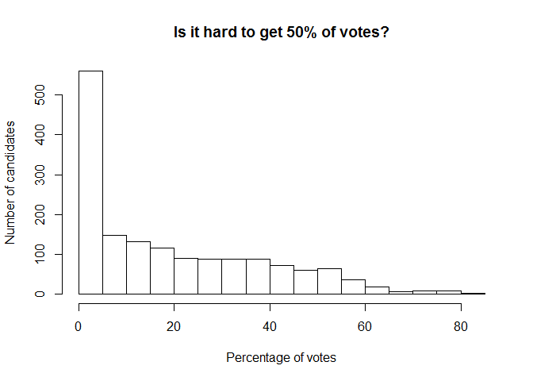
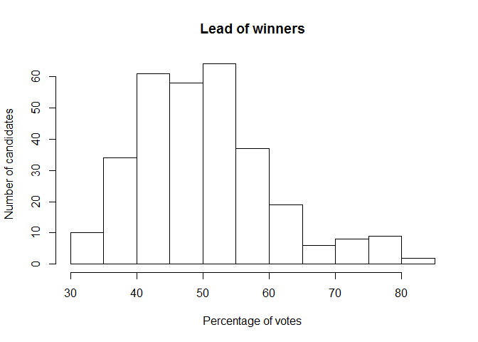

# Untitled

Let's have results in place


```r
# Analyze election results from Canadian Federal Elections 2011

library(readr)
library(dplyr)
```

```
## 
## Attaching package: 'dplyr'
## 
## The following objects are masked from 'package:stats':
## 
##     filter, lag
## 
## The following objects are masked from 'package:base':
## 
##     intersect, setdiff, setequal, union
```

```r
setwd(file.path(normalizePath("~"),"elections"))

## Get data
remote <- 
        "http://www.elections.ca/scripts/OVR2011/34/data_donnees/table_tableau12.csv"
local<-basename(remote)
if(!file.exists(local)) download.file(remote, local, mode="wb")
e <- read_csv(local)
e <- read_csv(remote)

## Clean data

# Vectorized function to drop everything after first slash - normally French
# location names - and replace spaces with dots

Englishize <- function(s, replace.spaces = FALSE) {
        sapply(s, 
               function(s) {
                        x <- strsplit(s, "/", fixed=TRUE) %>% unlist
                        x <- trimws(x[1])
                        if (replace.spaces) x <- gsub(" ", ".", x, fixed=TRUE)
                        return(x)
               }
        )
}

colnames(e) %>% Englishize(replace.spaces=TRUE) -> colnames(e)
e$Province %>% Englishize -> e$Province
e$Candidate %>% Englishize -> e$Candidate
e$Candidate.Residence %>% Englishize -> e$Candidate.Residence

numerize <- function(x) {
        x %>% trimws %>% as.numeric
}

e$Majority %>% numerize -> e$Majority
e$Majority.Percentage %>% numerize -> e$Majority.Percentage

## What are the most partisan places?

e %>% 
        arrange(desc(Percentage.of.Votes.Obtained)) %>%
        head(10) %>%
        glimpse
```

```
## Observations: 10
## Variables:
## $ Province                     (chr) "Alberta", "Alberta", "Alberta", ...
## $ Electoral.District.Name      (chr) "Crowfoot", "Wetaskiwin", "Vegrev...
## $ Electoral.District.Number    (int) 48010, 48026, 48024, 48025, 48020...
## $ Candidate                    (chr) "Kevin A Sorenson ** Conservative...
## $ Candidate.Residence          (chr) "Killam, Alta.", "Lacombe, Alta."...
## $ Candidate.Occupation         (chr) "Parliamentarian/", "College Inst...
## $ Votes.Obtained               (int) 44115, 37756, 39145, 32652, 40007...
## $ Percentage.of.Votes.Obtained (dbl) 84.0, 81.4, 79.8, 77.8, 77.5, 77....
## $ Majority                     (dbl) 39310, 32475, 33584, 27549, 34672...
## $ Majority.Percentage          (dbl) 74.8, 70.0, 68.5, 65.7, 67.1, 64....
```

```r
## What about BC?

e[e$Province=="British Columbia", ] %>%
        arrange(desc(Percentage.of.Votes.Obtained)) %>%
        head(10) %>%
        glimpse
```

```
## Observations: 10
## Variables:
## $ Province                     (chr) "British Columbia", "British Colu...
## $ Electoral.District.Name      (chr) "Abbotsford", "Langley", "Vancouv...
## $ Electoral.District.Number    (int) 59001, 59013, 59030, 59022, 59023...
## $ Candidate                    (chr) "Ed Fast ** Conservative", "Mark ...
## $ Candidate.Residence          (chr) "Abbotsford, B.C.", "Langley, B.C...
## $ Candidate.Occupation         (chr) "Parliamentarian/", "Parliamentar...
## $ Votes.Obtained               (int) 32493, 35569, 27794, 23946, 25109...
## $ Percentage.of.Votes.Obtained (dbl) 65.0, 64.5, 62.8, 62.1, 58.4, 57....
## $ Majority                     (dbl) 22404, 24292, 19433, 14070, 17082...
## $ Majority.Percentage          (dbl) 44.8, 44.1, 43.9, 36.5, 39.7, 35....
```

```r
stdev <- sd(e$Percentage.of.Votes.Obtained)
aver  <- mean(e$Percentage.of.Votes.Obtained)
cat(paste("68% of candidates get",
          round(aver - stdev),
          "to",
          round(aver + stdev),
          "percents of votes"))
```

```
## 68% of candidates get 0 to 38 percents of votes
```

```r
hist(e$Percentage.of.Votes.Obtained,
     main = "Is it hard to get 50% of votes?",
     xlab = "Percentage of votes",
     ylab = "Number of candidates")
```

 

```r
# Let's see what distribution is for winners

winners <- tapply(e$Percentage.of.Votes.Obtained,
                  e$Electoral.District.Number,
                  max)

hist(winners,
     main = "Lead of winners",
     xlab = "Percentage of votes",
     ylab = "Number of candidates")
```

 

```r
stdev <- sd(winners)
aver <- mean(winners)
cat(paste("68% of winning candidates get",
          round(aver - stdev),
          "to",
          round(aver + stdev),
          "percents of votes"))
```

```
## 68% of winning candidates get 40 to 61 percents of votes
```

